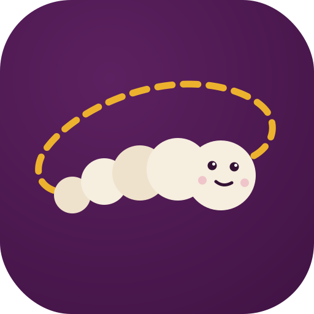

<p align="center"></p>

# Silkworm 🪱

*Spins its own threads.*

A Slack bot that runs on your own machine and gives **every Slack thread its own
Claude Code session**.

- DM the bot, or @-mention it in a channel → it replies **in a thread**.
- The first message in a thread starts a headless Claude session (`claude -p`);
  every later message resumes the same session (`claude --resume`), so each
  thread keeps independent context.
- Sessions persist in `sessions.json`, so threads survive bot restarts.

## Features

- **Live progress** — a placeholder message updates in place with what Claude is
  doing (`Bash: npm test…`, `Edit: bot.py…`) and becomes the final reply.
- **Cost footer** — each reply ends with `⏱ 42s · $0.0312 · thread total $0.45`.
- **Per-thread models** — `!model haiku` inside a thread switches just that thread.
- **Interrupt** — `!stop` kills the running turn in that thread.
- **Files both ways** — attach files to a message and Claude gets them on disk;
  files Claude produces (it's told about a per-turn outbox) are uploaded back
  into the thread.
- **Thread context** — @-mention the bot inside an existing conversation thread
  and it reads the prior messages first, so "summarize this thread" works.
- **Approval buttons** — optional `CLAUDE_APPROVAL_MODE=slack` gates tool calls
  behind Approve/Deny buttons in the thread (via a Claude Code PreToolUse hook).
- **Per-channel working dirs** — map `#myapp` → `~/code/myapp` so threads in
  that channel run Claude inside that repo.
- **Session hygiene** — stale thread sessions are swept after 30 days;
  `!sessions` lists active ones.
- **Runs as a service** — launchd plist included (starts on boot, restarts on crash).
- **User allowlist** — restrict who can drive the bot (and click approvals).

## Commands (inside a thread)

| Command | Effect |
|---|---|
| `!help` | Show commands |
| `!reset` / `!new` | Start this thread's session over |
| `!model <alias>` / `!model reset` | Switch this thread's model |
| `!stop` | Kill the currently running turn |
| `!terminal` | Get the command to continue this thread in your terminal |
| `!stats` | This thread's session info (model, turns, cost) |
| `!sessions` | List all active thread sessions |

## Prerequisites

- Claude Code installed and logged in (`claude` works in your terminal)
- Python 3.10+
- A Slack workspace where you can install apps (free tier is fine — a custom
  app counts as 1 of the 10 free-plan integrations)

## 1. Create the Slack app

1. Go to <https://api.slack.com/apps> → **Create New App** → **From a manifest**.
2. Pick your workspace, paste the contents of `manifest.json`, and create the app.
3. **Basic Information → App-Level Tokens** → *Generate Token* with the
   `connections:write` scope. Copy the `xapp-...` token (Socket Mode — no
   public URL needed).
4. **Install App** → install to your workspace → copy the **Bot User OAuth
   Token** (`xoxb-...`).

> Already created the app from an older manifest? Paste the new `manifest.json`
> into **App Manifest** on the app page and **reinstall** so the new scopes
> (files, history, users) and interactivity take effect.

## 2. Configure and run

```sh
git clone https://github.com/RyanSharp/Silkworm.git ~/workspace/Silkworm
cd ~/workspace/Silkworm
python3 -m venv .venv && source .venv/bin/activate
pip install -r requirements.txt
cp .env.example .env    # paste your two tokens; review the options
python3 bot.py
```

### Run on boot (launchd)

```sh
cp com.silkworm.plist ~/Library/LaunchAgents/
launchctl load ~/Library/LaunchAgents/com.silkworm.plist
# logs land in ./logs/bot.log and ./logs/bot.err.log
# stop with: launchctl unload ~/Library/LaunchAgents/com.silkworm.plist
```

> The plist assumes the project lives at `~/workspace/Silkworm`; edit the paths if you
> cloned elsewhere.

The plist reads config from `.env` (loaded by the bot itself), so no secrets
live in the plist.

## Configuration

All via `.env` — see `.env.example` for the full annotated list. Highlights:

| Variable | Default | Purpose |
|---|---|---|
| `SLACK_ALLOWED_USERS` | everyone | Comma-separated user IDs allowed to use the bot |
| `CLAUDE_CWD` | `./workspace` | Default directory Claude runs in |
| `CLAUDE_CHANNEL_DIRS` | — | JSON map of channel name/ID → directory |
| `CLAUDE_MODEL` | CLI default | Default model (per-thread override with `!model`) |
| `CLAUDE_APPROVAL_MODE` | `skip` | `skip` = full autonomy, `slack` = approval buttons, `gated` = plain permission mode |
| `APPROVAL_AUTO_ALLOW` | read-only tools | Tools that never need approval in `slack` mode |
| `CLAUDE_TIMEOUT` | `900` | Per-turn timeout (seconds) |
| `SESSION_MAX_AGE_DAYS` | `30` | Forget idle thread sessions after this long |

## How approval mode works

With `CLAUDE_APPROVAL_MODE=slack`, the bot registers a Claude Code
**PreToolUse hook** (`approval_hook.py`). Before each tool call, the hook POSTs
to the bot on `127.0.0.1:8787`; the bot posts Approve/Deny buttons in the
thread and blocks until someone clicks (default-deny after `APPROVAL_TIMEOUT`).
Read-only tools in `APPROVAL_AUTO_ALLOW` skip the buttons. Fails closed: if the
bot or hook is unreachable, the tool is denied.

## Moving a thread to the terminal

Every thread is a normal Claude Code session, so it works both ways: send
`!terminal` in a thread and Silkworm replies with the exact
`cd … && claude --resume <session-id>` to continue it interactively. Turns you
take in the terminal become part of the thread's history — the next Slack
message picks up right where you left off.

`!terminal` also *checks the thread out*: while checked out, Slack messages are
held with a warning instead of running (an interactive session loads history
once at launch, so Slack turns would be invisible to it). The checkout releases
itself automatically — run `python3 install_hooks.py` once to add
SessionStart/SessionEnd hooks to your `~/.claude/settings.json`, and the bot
gets notified when your terminal session opens and exits, reclaiming the thread
(with a note in Slack) the moment you quit. Escape hatches: `!back` reclaims
manually, `!takeover` force-closes a live terminal session (SIGTERM — completed
turns are already saved; only an in-flight generation is lost). Set
`HANDOFF_SLACK_WINS=1` to skip the warning entirely and have any Slack message
auto-close the terminal and take over.

## Starting a session from the terminal

The reverse direction also works — start in the terminal, continue in Slack:

```sh
./bin/silkworm "refactor auth" --dir ~/code/myapp
# add to PATH for convenience: ln -s ~/workspace/Silkworm/bin/silkworm /usr/local/bin/
```

The CLI registers the session with the bot, which posts an anchor message in
`SILKWORM_HOME_CHANNEL` (default: your most recent DM with the bot) — so the
session has a Slack thread and shows in the visualizer from the moment it
starts. Exit the terminal and the thread reclaims itself; reply in Slack to
keep going. If the bot is down, the session starts untracked.

## Session visualizer

```sh
python3 visualizer.py    # http://127.0.0.1:8790
```

A local web dashboard for every thread session (localhost-only):

- **Cost & cache analytics** — stat tiles (total spend, 14-day tokens, cache
  hit rate) and a daily stacked bar chart of cache-read / fresh-input / output
  tokens, with hover tooltips and a table view. Cache misses show up as blue
  bars — if the gold disappears, something is invalidating your prompt cache.
- **Live status badges** — running / checked out / in-terminal per thread,
  polled from the bot; a dot in the header shows whether the bot is up.
- **Transcripts** — markdown-rendered messages with per-turn token usage and
  cache-hit %, collapsible tool calls, results, and thinking.
- **Full-text search** across all thread transcripts.
- **Files** — everything exchanged with a thread (Slack uploads in, generated
  files out) listed with download links; outbound files are archived under
  `artifacts/`.
- **Reply from the web** — a composer that relays messages (and `!commands`,
  wired to the Stop / Take over / Model / Reset buttons) through the bot, so
  everything also lands in the Slack thread.

## Notes & limits

- The bot runs Claude as *you*, on *your* machine. In the default `skip` mode
  anyone who can message the bot can run arbitrary commands as your user — set
  `SLACK_ALLOWED_USERS`, or use `CLAUDE_APPROVAL_MODE=slack`, in any workspace
  you don't fully trust.
- Slack's free plan hides messages after 90 days, but Claude session history
  lives locally in `~/.claude`, so old threads still resume.
- Messages within one thread run serially (a session is single-turn-at-a-time);
  different threads run in parallel.
